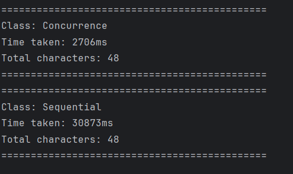

# Concurrence Project

English version: [README](README.md)

## Resumen

Este proyecto es una aplicación Maven multi-módulo que demuestra enfoques secuenciales y concurrentes para procesar datos de la API de Disney. Consta de dos módulos principales:

- **disneyapi**: Proporciona funcionalidades para obtener datos de personajes e imágenes de Disney.
- **excecutetest**: Contiene implementaciones de prueba para comparar métodos de procesamiento secuencial y concurrente.

## Módulos

### disneyapi
- Obtiene detalles de personajes desde la [Disney API](https://api.disneyapi.dev).
- Descarga las imágenes de los personajes.
- Contiene el modelo de dominio y utilidades para el mapeo.

### excecutetest
- Implementa dos estrategias para calcular el tamaño total de las imágenes:
    - **Sequential**: Procesa la descarga de imágenes de forma individual.
    - **Concurrence**: Utiliza hilos virtuales para el procesamiento concurrente.
- Incluye una utilidad simple de cálculo de tiempo para comparar el rendimiento de ambos enfoques.

## Resultado
El enfoque con hilos virtuales es 10 veces más rapido que el secuencial.
